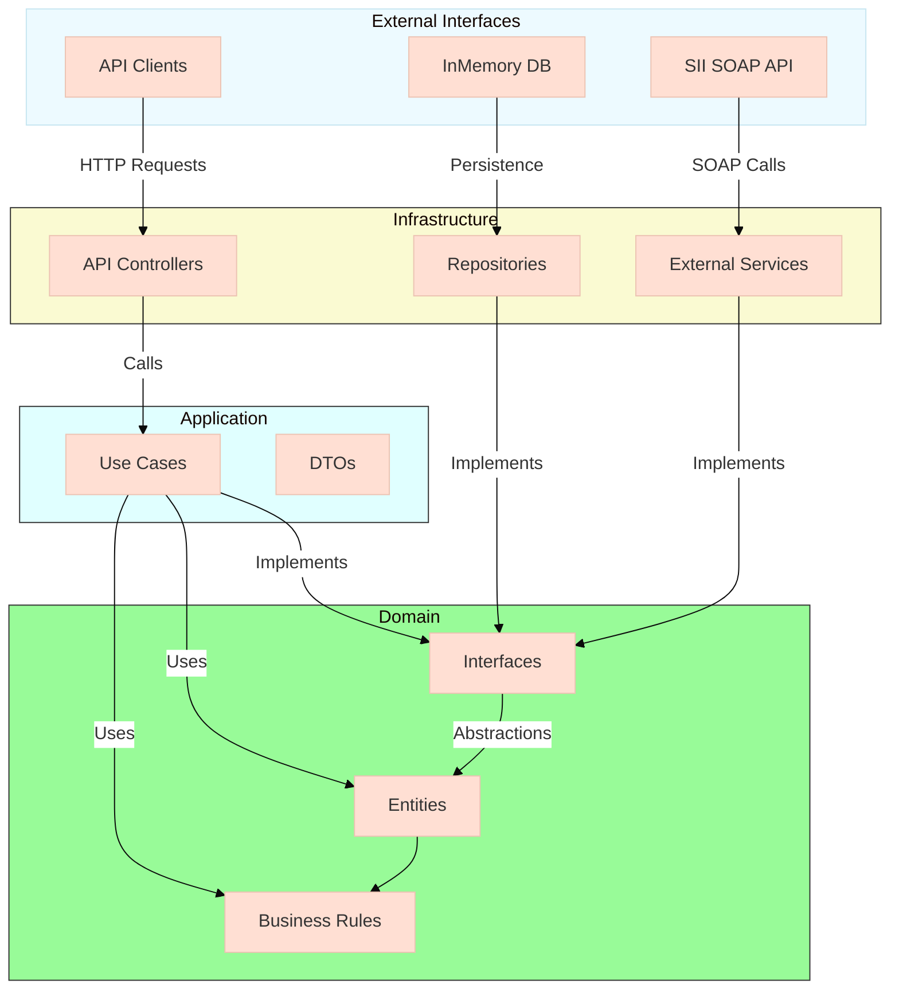

# DTE ShortURL - Acortador de URLs para Documentos Tributarios Electrónicos
Este proyecto es una aplicación para acortar URLs, gestionar su ciclo de vida y redirigir a los usuarios a las URLs originales.
Esto es una prueba de conceptos para demostrar una implementación de arquitectura hexagonal.


### ¿Por qué Arquitectura Hexagonal?
Esta implementación utiliza arquitectura hexagonal (también llamada "puertos y adaptadores") porque:

- **Desacoplamiento**: El núcleo de negocio (dominio) no depende de tecnologías externas
- **Testabilidad**: Permite probar la lógica de negocio sin infraestructura
- **Flexibilidad**: Se pueden cambiar bases de datos u otro servicio sin afectar el dominio
- **Enfoque DTE**: Ideal para integraciones con sistemas de terceros como el WS de SII
  
## Diagrama 



## Características
- Crear URLs cortas a partir de URLs originales.
- Redirigir a la URL original utilizando el código corto.
- Manejo de expiración de URLs.
- Límite de accesos configurables para cada URL corta.

## Seguridad Implementada
- **JWT** Tokens firmados con HS256 para autenticación stateless
- Control de expiración de JWT token en archivo de configuración externo al código

# Estructura del proyecto
```text
/root
├── src/
│   ├── Application/      # Lógica de casos de uso
│   ├── Domain/           # Entidades y reglas de negocio
│   ├── Infrastructure/   # Implementaciones concretas
│   └── WebApi/           # Capa de presentación
└── tests/                # Pruebas unitarias
```

# Endpoints


| Método  | Endpoint            | Descripción                          | Autenticación    |
|:-------:|:-------------------:|:------------------------------------:|:----------------:|
| POST    | `/api/auth/login`   | Autenticación para obtener JWT       | Pública          |
| POST    | `/api/shorturl`     | Crear nuevo ShortURL                 | JWT (Admin)      |
| GET     | `/{code}`           | Redirección a URL original           | Pública          |
| GET     | `/api/shorturl/all` | Retorna todos los codigos en memoria | JWT (dev only)   |

# Pruebas en Entorno de Desarrollo

Puedes probar la API directamente en nuestro entorno de Azure:

🔗 [Interfaz Swagger para Pruebas](https://webapichallenge-gugve0degpdeguba.canadacentral-01.azurewebsites.net/swagger/index.html)


# Pruebas en Entorno Local
## Requisitos Previos
DOTNET 9 instalado en su sistema.
Un editor de código como Visual Studio o Visual Studio Code.

### Instalación:
- Clonar este repositorio
- Abrir el archivo sln en la carpeta principal (opcional)
- Dirigirse a WebApi
- reemplazar el nombre del archivo `appsettings.example.json` por `appsettings.json`
- En la carpeta WebApi ejecutar el siguiente comando
  
  ```
  dotnet build
  dotnet run
  ```
- Acceder al endpoint `/swagger.html` o ejecutar en orden las request del archivo `WebApi.http`
