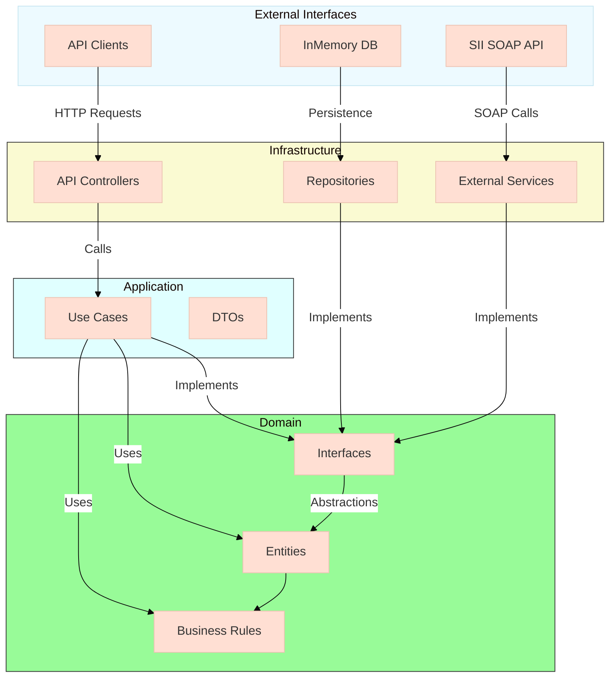

# Proyecto de Acortador de URLs
Este proyecto es una aplicación para acortar URLs, gestionar su ciclo de vida y redirigir a los usuarios a las URLs originales.
Esto es una prueba de conceptos para demostrar una implementación de arquitectura hexagonal.

## Diagrama 



## Características
- Crear URLs cortas a partir de URLs originales.
- Redirigir a la URL original utilizando el código corto.
- Manejo de expiración de URLs.
- Límite de accesos configurables para cada URL corta.

## Requisitos Previos
DOTNET 9 instalado en su sistema.
Un editor de código como Visual Studio o Visual Studio Code.
Instalación:
- Clonar este repositorio
- abrir el archivo sln en la carpeta principal
- dirigirse a WebApi
- en la carpeta WebApi ejecutar el siguiente comando
  ```
  dotnet build
  dotnet run
  ```
